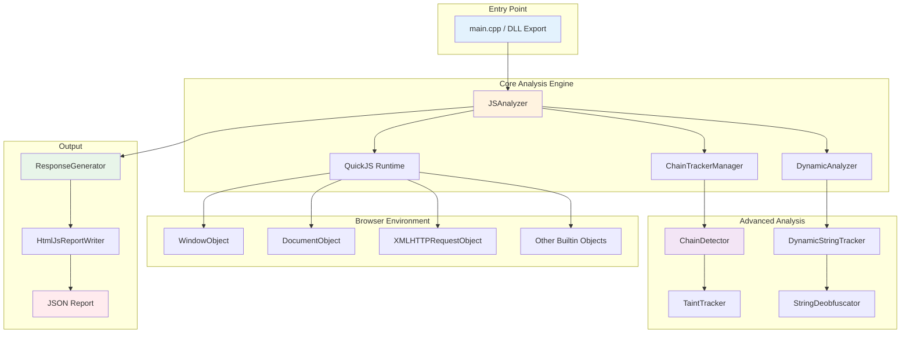
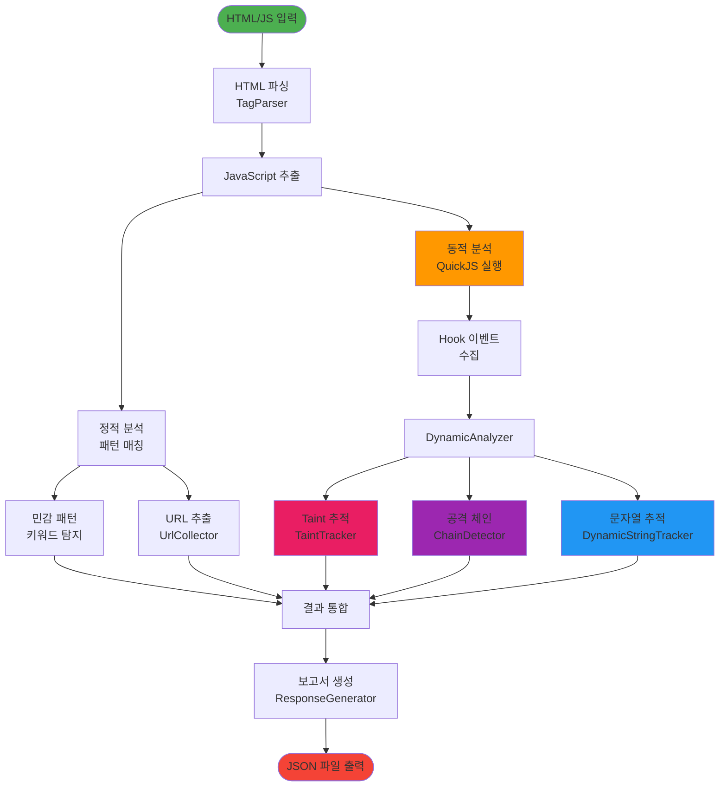
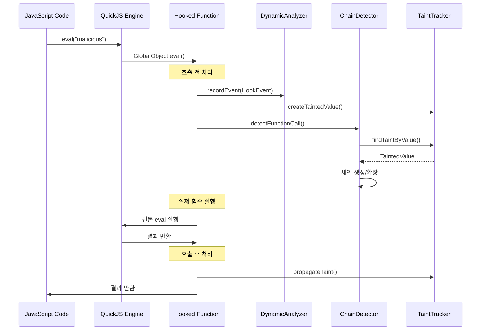
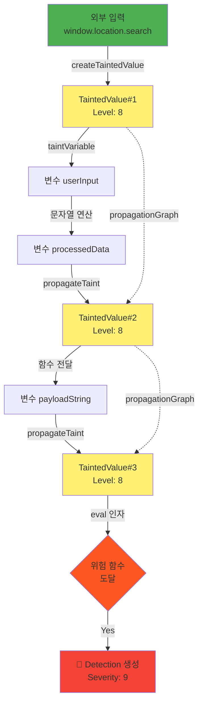
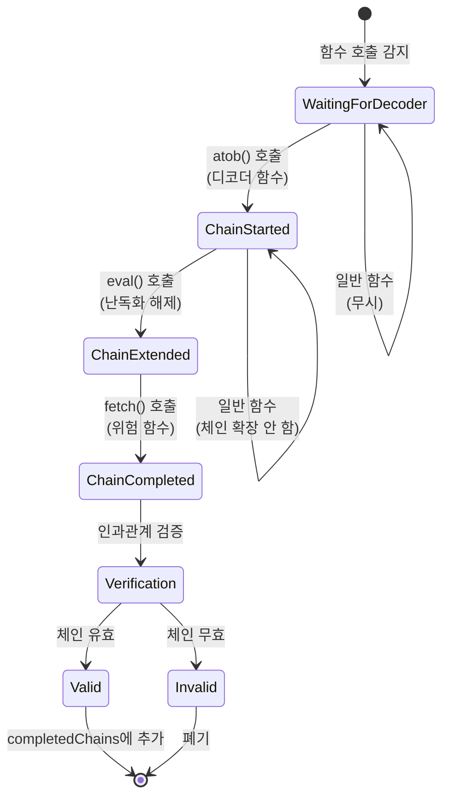
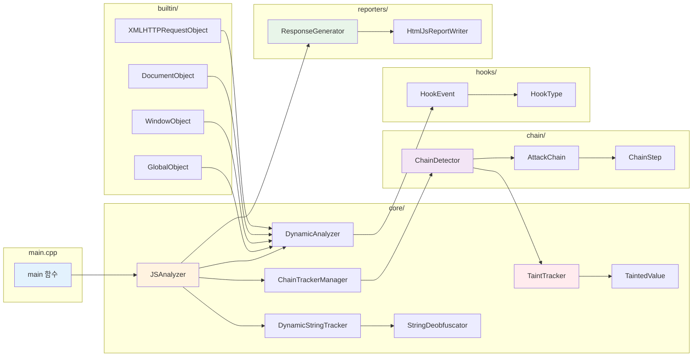
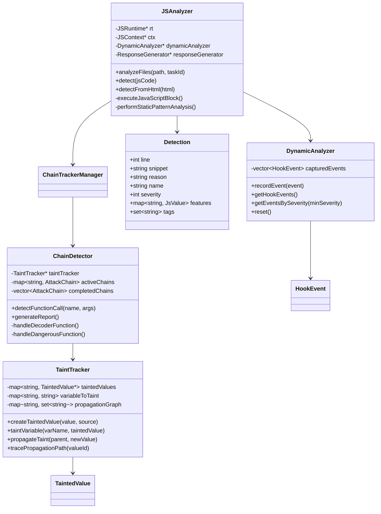
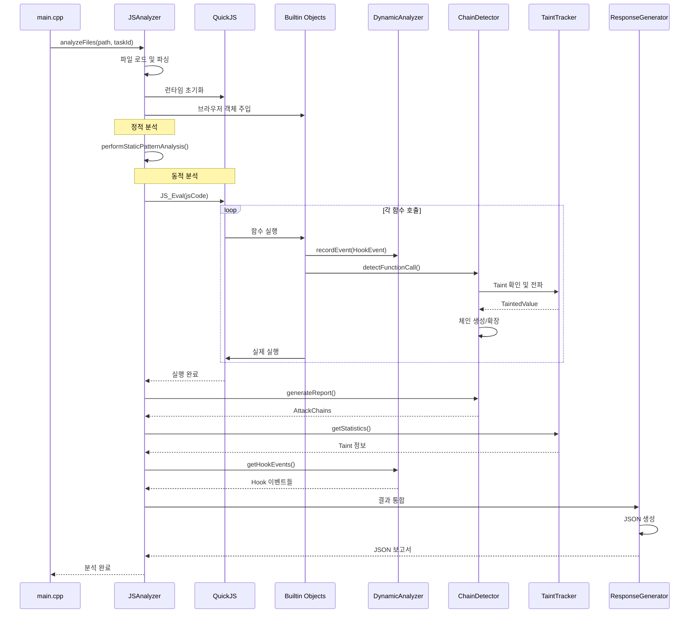
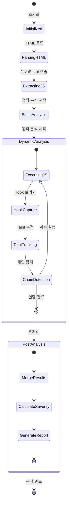

# HtmlJSScanner 아키텍처 다이어그램

## 1. 전체 시스템 아키텍처



## 2. 데이터 흐름 다이어그램



## 3. Hook 시스템 상호작용



## 4. Taint 전파 메커니즘



## 5. 공격 체인 재구성 과정



## 6. 컴포넌트 의존성 그래프



## 7. 클래스 다이어그램 (주요 클래스)



## 8. 실행 시퀀스 (전체 분석 과정)



## 9. 파일 시스템 레이아웃

```
HtmlJSScanner/
│
├── 📁 core/                    # 핵심 분석 엔진
│   ├── JSAnalyzer.h/cpp       # 메인 분석 오케스트레이터
│   ├── DynamicAnalyzer.h/cpp  # Hook 이벤트 수집
│   ├── TaintTracker.h/cpp     # 오염 데이터 추적
│   ├── TaintedValue.h/cpp     # 오염 값 모델
│   ├── DynamicStringTracker.h/cpp  # 문자열 추적
│   ├── StringDeobfuscator.h/cpp    # 디옵스퓨스케이션
│   └── ChainTrackerManager.h/cpp   # 체인 관리
│
├── 📁 chain/                   # 공격 체인 분석
│   ├── ChainDetector.h/cpp    # 체인 자동 탐지
│   ├── AttackChain.h/cpp      # 체인 모델
│   └── ChainStep.h/cpp        # 체인 단계
│
├── 📁 builtin/                 # 브라우저 환경 모킹
│   ├── 📁 helpers/            # 유틸리티
│   │   ├── Base64Utils.h/cpp
│   │   ├── SensitiveKeywordDetector.h/cpp
│   │   └── ...
│   └── 📁 objects/            # 브라우저 객체
│       ├── WindowObject.h/cpp
│       ├── DocumentObject.h/cpp
│       ├── XMLHTTPRequestObject.h/cpp
│       └── ...
│
├── 📁 hooks/                   # Hook 시스템
│   ├── HookType.h             # Hook 타입 정의
│   ├── HookEvent.h/cpp        # Hook 이벤트
│   └── Hook.h                 # Hook 인터페이스
│
├── 📁 parser/                  # 파싱 계층
│   ├── 📁 html/
│   ├── 📁 js/
│   └── 📁 css/
│
├── 📁 model/                   # 데이터 모델
│   ├── Detection.h/cpp
│   ├── JsValueVariant.h/cpp
│   └── DataNode.h/cpp
│
├── 📁 reporters/               # 보고서 생성
│   ├── ResponseGenerator.h/cpp
│   ├── HtmlJsReportWriter.h/cpp
│   └── 📁 metadata/
│
├── 📁 utils/                   # 유틸리티
│   └── Logger.h/cpp
│
├── 📁 test/                    # 테스트 케이스
│   ├── clipboard_hijacking_test.html
│   ├── chain_obfuscator_test.js
│   └── 📁 adam/               # 실제 악성코드 샘플
│
├── 📁 docs/                    # 문서
│   ├── COMPREHENSIVE_PROJECT_REPORT.md  ⬅️ 본 보고서
│   ├── PROJECT_SUMMARY.md
│   ├── ARCHITECTURE_DIAGRAMS.md         ⬅️ 현재 파일
│   └── ...
│
├── main.cpp                    # 프로그램 진입점
├── HtmlJSScanner.h/cpp        # DLL 인터페이스
├── pch.h                       # 사전 컴파일 헤더
├── CMakeLists.txt             # CMake 빌드
└── HtmlJSScanner.sln          # Visual Studio 솔루션
```

---

## 10. 탐지 엔진 상태 머신



---

*이 다이어그램들은 HtmlJSScanner 프로젝트의 구조와 동작 원리를 시각적으로 표현합니다.*

**버전**: 1.0.0  
**마지막 업데이트**: 2025-01-03
