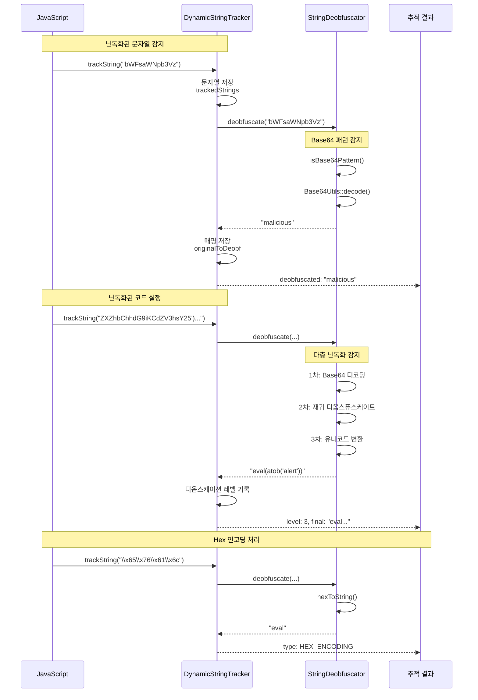

# JSScanner 상세 탐지 과정 다이어그램

## 1. 전체 탐지 플로우 (상세)


## 2. Hook 기반 탐지 메커니즘 (세부)


## 3. Taint 전파 상세 과정

```mermaid
graph TB
    subgraph "1단계: Taint 생성"
        A1[외부 입력 소스] -->|window.location.search| B1[createTaintedValue]
        B1 --> C1[TaintedValue 생성<br/>ID: taint_001<br/>Level: 8<br/>Source: location.search]
    end
    
    subgraph "2단계: 변수 할당"
        C1 -->|var param = ...| D1[taintVariable]
        D1 --> E1[변수-Taint 매핑<br/>param → taint_001]
    end
    
    subgraph "3단계: 문자열 연산"
        E1 -->|var url = 'api/' + param| F1[propagateTaint]
        F1 --> G1[새 TaintedValue<br/>ID: taint_002<br/>Parent: taint_001<br/>Level: 8]
        G1 --> H1[변수 업데이트<br/>url → taint_002]
    end
    
    subgraph "4단계: 전파 그래프"
        G1 -.->|propagationGraph| I1[taint_001 → taint_002]
        H1 -.->|variableToTaint| J1[url → taint_002]
    end
    
    subgraph "5단계: 위험 함수 도달"
        H1 -->|fetch(url)| K1{위험 함수 검사}
        K1 -->|tainted| L1[🚨 Detection 생성<br/>Type: DATA_EXFILTRATION<br/>Severity: 9]
        K1 -->|clean| M1[정상 동작]
    end
    
    subgraph "6단계: 전파 경로 추적"
        L1 --> N1[tracePropagationPath]
        N1 --> O1[taint_002 → taint_001 → location.search]
        O1 --> P1[완전한 전파 경로<br/>보고서에 포함]
    end
    
    style A1 fill:#4caf50
    style C1 fill:#fff176
    style G1 fill:#fff176
    style L1 fill:#f44336
    style O1 fill:#ff9800
```

## 4. 공격 체인 탐지 알고리즘


## 5. 문자열 추적 및 난독화 해제



## 6. 정적 분석 상세 과정


## 7. 브라우저 객체 시뮬레이션


## 8. 결과 생성 및 리포팅

```mermaid
flowchart TD
    START([분석 완료]) --> COLLECT[모든 Detection 수집]
    
    COLLECT --> DYNAMIC_RES[동적 분석 결과<br/>DynamicAnalyzer]
    COLLECT --> CHAIN_RES[체인 탐지 결과<br/>ChainDetector]
    COLLECT --> TAINT_RES[Taint 추적 결과<br/>TaintTracker]
    COLLECT --> STRING_RES[문자열 분석 결과<br/>DynamicStringTracker]
    COLLECT --> STATIC_RES[정적 분석 결과]
    
    DYNAMIC_RES --> MERGE[결과 통합<br/>ResponseGenerator]
    CHAIN_RES --> MERGE
    TAINT_RES --> MERGE
    STRING_RES --> MERGE
    STATIC_RES --> MERGE
    
    MERGE --> DEDUPE[중복 제거]
    DEDUPE --> SORT[위험도 정렬]
    
    SORT --> BUILD_META[메타데이터 구성]
    BUILD_META --> BUILD_DETECTIONS[탐지 목록 구성]
    BUILD_DETECTIONS --> BUILD_CHAINS[체인 정보 구성]
    BUILD_CHAINS --> BUILD_TAINT[Taint 그래프 구성]
    BUILD_TAINT --> BUILD_STATS[통계 정보 구성]
    
    BUILD_STATS --> JSON_GEN[JSON 생성<br/>HtmlJsReportWriter]
    
    subgraph "JSON 구조"
        JSON_GEN --> META[metadata:<br/>taskId, timestamp, version]
        JSON_GEN --> SUMMARY[summary:<br/>totalDetections, maxSeverity]
        JSON_GEN --> DETECTIONS[detections: [<br/>line, snippet, reason, severity<br/>]]
        JSON_GEN --> CHAINS[attackChains: [<br/>steps, severity, taintPath<br/>]]
        JSON_GEN --> TAINTS[taintTracking:<br/>propagationGraph]
        JSON_GEN --> HOOK_EVENTS[hookEvents: [<br/>functionName, args, result<br/>]]
    end
    
    JSON_GEN --> SAVE[파일 저장]
    SAVE --> OUTPUT([JSON 파일 출력])
    
    style START fill:#4caf50
    style MERGE fill:#2196f3
    style JSON_GEN fill:#ff9800
    style OUTPUT fill:#f44336
```

## 9. 위험도 계산 메커니즘


## 10. 실제 악성 코드 분석 예시


## 11. 성능 최적화 및 에러 처리


---

## 요약

이 다이어그램들은 JSScanner 프로젝트의 **탐지 과정**을 단계별로 상세하게 보여줍니다:

1. **전체 플로우**: 파일 입력부터 JSON 출력까지의 전체 과정
2. **Hook 메커니즘**: 함수 호출 감지 및 분석 과정
3. **Taint 전파**: 오염된 데이터의 추적 과정
4. **공격 체인**: 다단계 공격 탐지 알고리즘
5. **문자열 추적**: 난독화 해제 과정
6. **정적 분석**: 키워드 및 패턴 기반 탐지
7. **객체 시뮬레이션**: 브라우저 환경 모킹
8. **리포팅**: 결과 생성 및 JSON 구성
9. **위험도 계산**: Severity 점수 산정
10. **실제 예시**: 악성 코드 분석 시나리오
11. **에러 처리**: 예외 및 성능 관리

**핵심 특징**:
- 정적 + 동적 분석의 하이브리드 접근
- Taint 기반 데이터 흐름 추적
- 다단계 공격 체인 자동 재구성
- 난독화 자동 해제
- 실시간 Hook 기반 모니터링

**버전**: 1.0.0  
**작성일**: 2025-01-10
