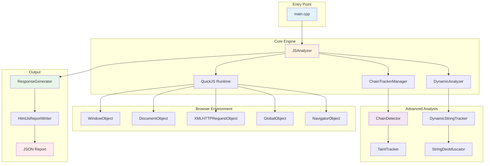
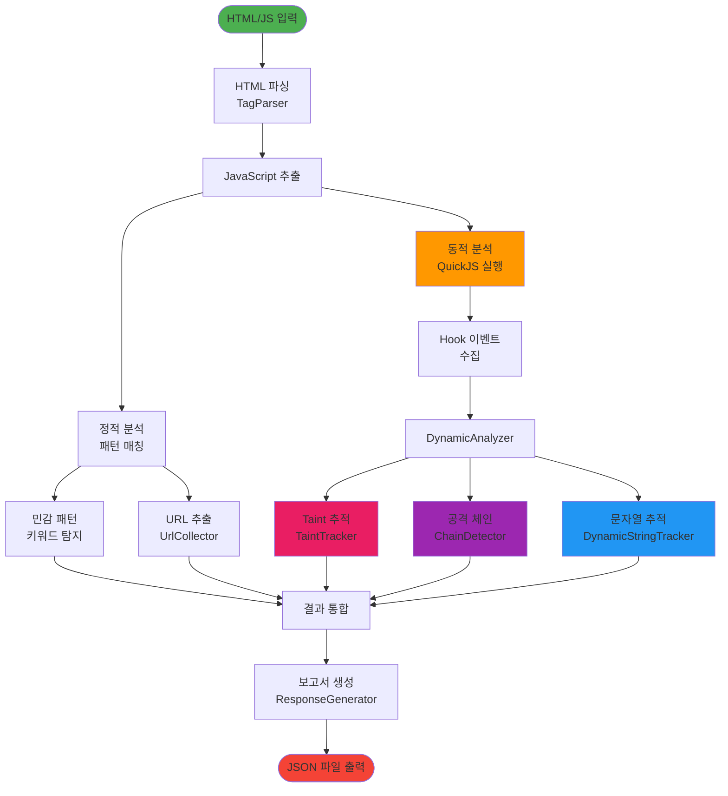
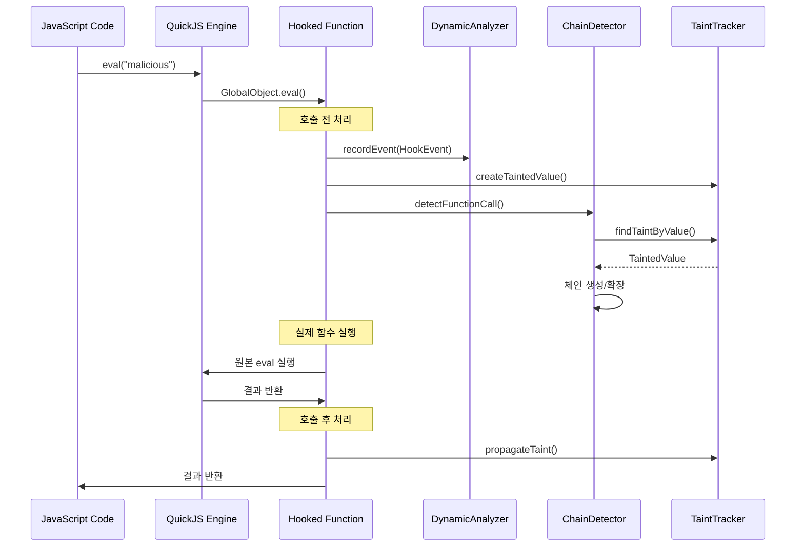
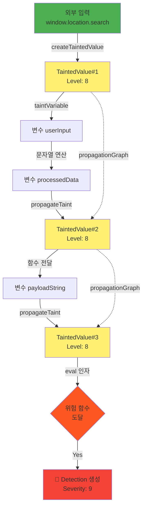
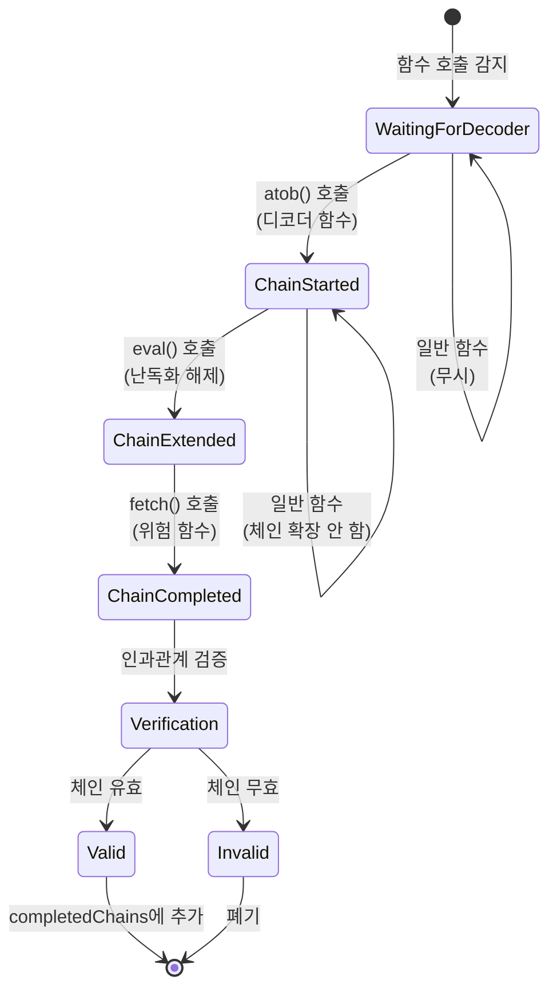
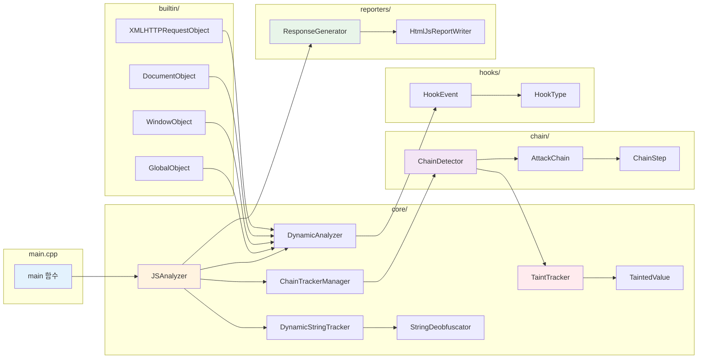
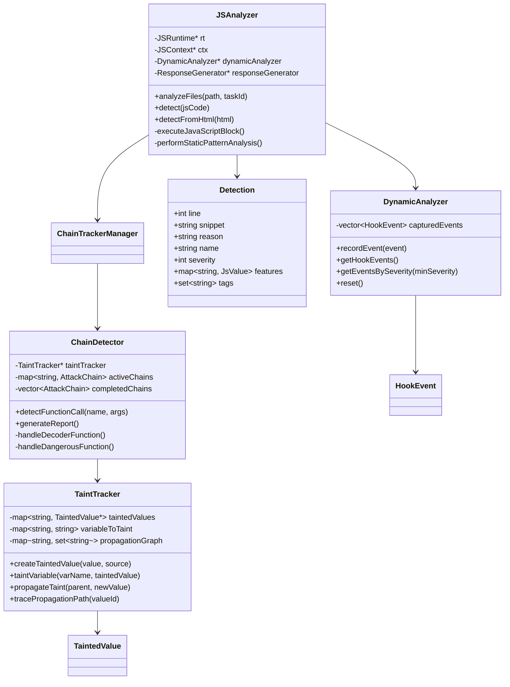
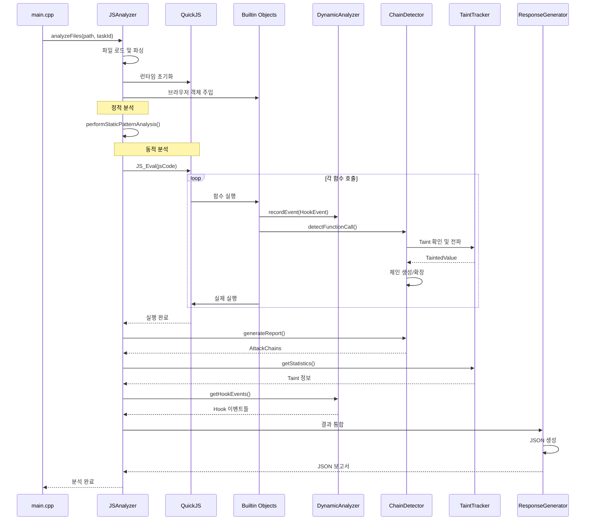
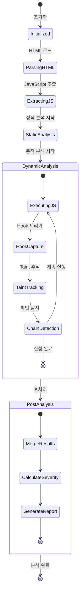
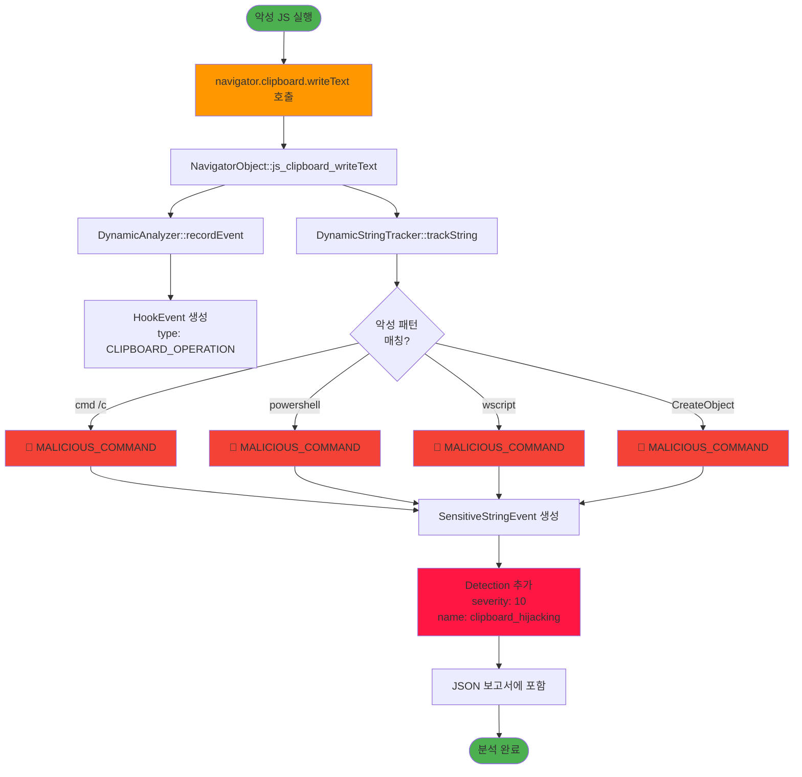

# JSScanner - 모듈 종속관계 다이어그램

## 1. 전체 시스템 아키텍처

## 2. 데이터 흐름 다이어그램

## 3. Hook 시스템 상호작용

## 4. Taint 전파 메커니즘

## 5. 공격 체인 재구성 과정

## 6. 컴포넌트 의존성 그래프

## 7. 클래스 다이어그램 (주요 클래스)

## 8. 실행 시퀀스 (전체 분석 과정)

## 9. 탐지 엔진 상태 머신

## 10. 악성코드 탐지 플로우 (클립보드 하이재킹 예시)

---

**다이어그램 버전**: 1.0  
**마지막 업데이트**: 2025-01-03
