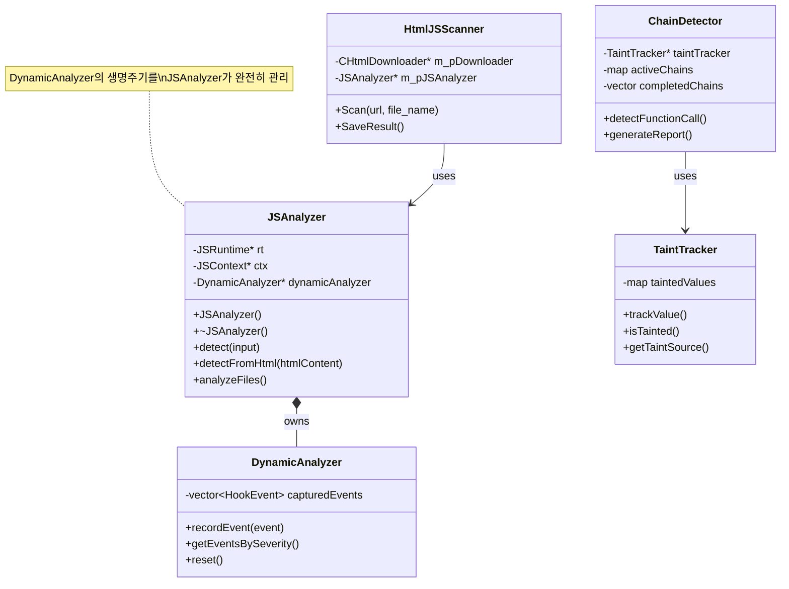

## 🧪 테스트 구조

### 📁 테스트 파일
```
test/
├── adam/              # Adam 악성코드 샘플
├── test_obfuscator.js # 난독화 테스트
├── exfilterator.js    # 데이터 유출 테스트
└── chain_obfuscator_test.js # 체인 난독화
```

### 📊 테스트 결과
```
test_result/
├── cpp_ver_result.txt  # C++ 버전 결과
├── java_ver_result.txt # Java 버전 비교
└── target.js          # 테스트 대상
```

---

## 🔧 빌드 및 실행

### 빌드 명령
```bash
# CMake 빌드
cmake -B build
cmake --build build

# Visual Studio
msbuild HtmlJSScanner.sln /p:Configuration=Release
```

### 실행 예제
```bash
# URL 스캔
HtmlJSScanner.exe \"http://malicious-site.com\" output_001

# 로컬 파일 스캔  
HtmlJSScanner.exe \"file:///C:/test.html\" output_002
```

---

## 🏗️ 프로젝트 리팩토링 계획

### 📋 현재 구조의 문제점
- **혼재된 책임**: 여러 기능이 단일 디렉토리에 섞임
- **불명확한 의존성**: 순환 참조 가능성
- **탐색 어려움**: 특정 기능 찾기 어려움

### 🎯 목표 구조
```
HtmlJSScanner/
├── core/             # 핵심 분석 엔진
│   ├── JSAnalyzer
│   └── DynamicAnalyzer
├── parsers/          # 모든 파서
│   ├── js/
│   ├── html/
│   └── css/
├── detectors/        # 탐지 로직
│   ├── ChainDetector
│   └── StringDeobfuscator
├── trackers/         # 추적 시스템
│   ├── taint/
│   ├── data/
│   └── network/
├── sandbox/          # 실행 환경
│   ├── runtime/
│   └── hooks/
├── models/           # 데이터 모델
│   ├── core/
│   └── metadata/
└── reporters/        # 보고서 생성
```

---

## 📈 향후 개선 사항

### 1️⃣ **성능 최적화**
- **병렬 처리**: 멀티스레딩으로 분석 속도 개선
- **캐싱**: 반복 분석 결과 캐싱
- **메모리 관리**: 대용량 파일 처리 개선

### 2️⃣ **기능 확장**
- **추가 난독화 패턴**
  - JSFuck 디코딩
  - AAEncode/JJEncode 지원
  - 커스텀 패커 탐지

- **머신러닝 통합**
  - 행위 패턴 학습
  - 이상 탐지 모델
  - 제로데이 탐지

- **실시간 모니터링**
  - 브라우저 확장 프로그램
  - 프록시 모드 지원
  - 웹소켓 분석

### 3️⃣ **보안 강화**
- **샌드박스 강화**: 더 엄격한 격리
- **타임아웃 관리**: 무한 루프 방지
- **리소스 제한**: CPU/메모리 제한

### 4️⃣ **사용성 개선**
- **GUI 인터페이스**: 웹 대시보드
- **API 서버**: RESTful API 제공
- **도커 컨테이너**: 쉬운 배포

---

## 📊 주요 클래스 다이어그램



---

## 📚 참고 문서

- [MIGRATION.md](./MIGRATION.md) - 프로젝트 구조 개선 계획
- [quickjs.h](./quickjs.h) - QuickJS 엔진 인터페이스
- [CMakeLists.txt](./CMakeLists.txt) - 빌드 설정

---

## 🔑 핵심 기능 요약

| 기능 | 설명 | 담당 모듈 |
|------|------|-----------|
| **HTML 파싱** | 악성 태그/속성 탐지 | `TagParser` |
| **JS 실행** | 동적 코드 실행 및 분석 | `JSAnalyzer` |
| **난독화 해제** | 인코딩된 코드 복원 | `StringDeobfuscator` |
| **오염 추적** | 데이터 흐름 모니터링 | `TaintTracker` |
| **체인 탐지** | 연속 악성 행위 분석 | `ChainDetector` |
| **후킹** | 함수 호출 가로채기 | `Hook System` |
| **샌드박싱** | 격리된 실행 환경 | `Builtin Objects` |
| **URL 수집** | 외부 리소스 추적 | `UrlCollector` |
| **보고서 생성** | 분석 결과 출력 | `ResponseGenerator` |

---

> 📅 **최종 업데이트**: 2025-01-XX  
> 📌 **버전**: 1.0.0  
> 👥 **담당**: Security Team
`